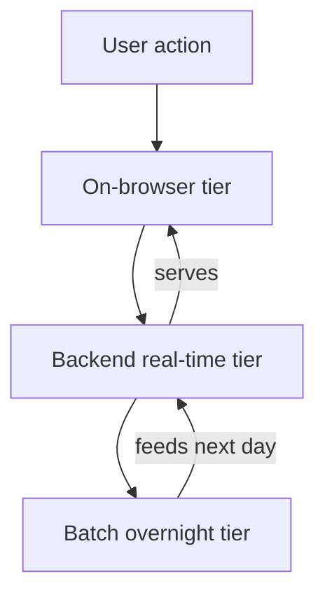
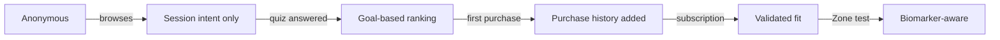

# ARCHITECTURE.md
# Healf Personalisation — ML System Design

## 1. Use Cases

I spent time on healf.com before writing this. Created an account, took the quiz, used Helix, clicked through products. The honest observation: the "For You" page doesn't know you. Healf doesn't ask for age, gender, or goals at signup. The quiz exists but doesn't visibly change anything. Helix shows the same four chips to everyone. A product page shows a nutritional label and an add-to-cart button — nothing more.

The gap isn't the recommendation algorithm. The gap is that the system has almost no signal to work with. So the experiences I chose are ordered by that reality — get signal first, then use it.

**Experience 1 — Get to know the user (For You page)**

Helix opens with four identical chips for everyone. Same chips whether you're a 25-year-old athlete or a 50-year-old with a thyroid condition.

What changes: when a logged-in user opens Helix with little or no data, Helix starts a short conversation. Not a form. "What's bringing you to Healf today?" The user talks. An agent reads the conversation, pulls out structured facts — goals, current supplements, health concerns — and writes them into the user's profile. Each session adds more without the user filling in a form.

The chips also change. If your profile says sleep goal and you bought Magnesium last month, the chip becomes "How is your sleep lately?" not "Help me sleep better." Small change, completely different feeling. Voice-first on mobile is the natural next step — the architecture supports it without changes.

Cold start: we say so honestly. "We don't know you well enough yet — tell us one thing about your health." Better than fake "Top Match" badges on sea salt.

**Experience 2 — Ranked shelf (For You page)**

Once we have signal, the shelf ranks against it. Sleep goal → sleep products first. Already buying Magnesium for three months → don't show it, show what's missing. Shelf title changes from "Bestsellers" to "For you this week."

Signals: quiz answers, Helix conversation, purchase history, subscription status (strongest — reordering means it's working), browse without purchase (weakest). Oura Ring or Whoop bought from Healf → sleep score and HRV feed in as continuous signal between blood tests.

Cold start: bestsellers shelf with a clear quiz invitation. We don't pretend it's personalised until it is.

**Experience 3 — Why this is right for you (product page)**

Every product page shows the same thing to everyone. Nothing connects the product to the specific person looking at it.

What changes: one block above the add-to-cart button.

- Quiz user: "Your goal is better sleep. Magnesium Glycinate directly supports sleep quality."
- Zone member: "Your January test showed Magnesium at 0.65 mmol/L. This addresses it."
- Cold start: "312 people with sleep goals bought this in the last 30 days."

Rule-based first — user goal → ingredient → clinical claim from the knowledge graph. No ML needed on day one.

**Experience 4 — Products that complete your stack (product page)**

Added below the existing shelf, not replacing it. Only appears when we have enough signal to say something true.

- 2+ purchases + quiz done → "You take Magnesium, your goal is sleep. Vitamin D3 and L-Theanine are what people like you add next." Never recommends what you already own.
- Quiz only, no purchases → "People with your sleep goal also take these."
- No data → nothing. A second generic shelf adds noise, not value.

**Experience 5 — Four-agent reasoning behind Helix**

Invisible to the user but changes everything Helix returns. Four specialist agents — one per pillar (Eat, Move, Mind, Sleep) — each read the user's message and produce candidate products. Where two or more agents agree, confidence goes up. An LLM judge checks for conflicts before anything reaches the user.

Example: "I train hard, sleep badly, feel stressed." Move agent and Sleep agent both suggest Magnesium → surfaces at the top. Mind agent suggests Ashwagandha → LLM judge checks interactions → no conflicts → included with a plain-English reason.

**What I deliberately left out:** Wearable integration (Oura, Whoop) — the architecture supports it but building the data integrations is a week of work. I've noted where it fits but didn't build it.

---

## 2. Metrics

| Experience | Primary metrics | Guardrail |
|---|---|---|
| 1 — Know the user | % users with 3+ profile fields after 7 days; subscription conversion profiled vs not | Signup completion must not drop below baseline |
| 2 — Ranked shelf | Recommendation CTR vs bestsellers; one-time to subscription rate | Return rate on recommended products must not rise |
| 3 — Why right for you | Add-to-cart rate with personal note vs without | Complaint rate on irrelevant recommendations |
| 4 — Stack completion | Attach rate — second product in same session; average order value | Must never recommend something user already owns |
| 5 — Agent reasoning | Helix session-to-purchase rate; thumbs up/down on responses | — |

On Experience 1: bounce rate will likely rise when we ask questions upfront. That's acceptable if subscription conversion and 90-day retention go up. We track both.

---

## 3. Stack Design

Three tiers. The boundary between them is latency and how fresh the data needs to be.

**On-browser** — no server round-trip, runs in the browser itself.

What lives here: session intent detection. As the user browses — pages visited, products hovered, time on a product page — a small model infers current intent. Three sleep products viewed in five minutes → shelf re-ranks toward sleep immediately. Waiting for a server round-trip would make this feel broken.

Model: lightweight intent classifier, quantised to run in the browser using ONNX Runtime. Input: last 10 page views. Output: probability across the four pillars (Eat, Move, Mind, Sleep).

Failure mode: model fails to load → falls back to batch-computed ranked list. No visible breakage.

One risk with session intent re-ranking is filter bubbles — browse three sleep products and the shelf narrows permanently toward sleep. We mitigate this two ways: session intent resets when the session ends, so the shelf returns to the goal-based default. And we enforce a diversity floor — at least one product from each pillar always appears in the top 10 regardless of session signal. Discovery matters as much as relevance.

**Backend real-time** — server-side, within 200ms.

What lives here: full personalisation. When the For You page loads, the personalisation service fetches the user's profile from the knowledge graph, scores products, and returns a ranked list with reasons. Helix four-agent reasoning also runs here.

Model: start with a gradient boosted model on hand-crafted features (goal overlap, pillar match, subscription status). Graduate to a two-tower retrieval model once we have enough interaction data.

Failure mode: service times out → serve the last batch-computed ranked list. We alert if timeout rate exceeds 1%.

**Batch** — runs overnight, feeds the other two tiers.

What lives here: user embeddings from the knowledge graph (run weekly once the graph is dense enough), collaborative patterns, model retraining, biomarker delta analysis for Zone members.

Failure mode: batch job fails → serve previous day's output. No user-facing breakage.

---

## 4. Cold Start Strategy

The rule is simple: we never pretend to know more than we do.

Anonymous visitor → on-browser session model runs immediately, re-ranks based on what they browse. No account needed.

New user who took the quiz → goal-based recommendations from the knowledge graph on day one. No purchase history needed — the graph traversal from goals to products works immediately.

New user who skipped the quiz → bestsellers shelf with one embedded question. One answer is enough to start ranking.

Experience 4 (stack completion) only appears from step D onward — before that there's nothing useful to say, so we say nothing.

---

## 5. Model Lifecycle

Models degrade quietly. A model trained in January on winter buying patterns will underperform in summer without anyone noticing.

We watch three signals continuously: recommendation click rate, add-to-cart rate from recommendations, and return rate on recommended products. If any drift more than 10% from baseline we investigate before assuming it's noise.

Retraining: monthly, on the previous 90 days of data. Before any new model goes live it runs offline against held-out interactions. We only deploy if metrics match or beat the current model.

Deployment: canary release — 5% of traffic for 48 hours. If primary metrics hold and guardrails don't regress, we roll out fully. Rollback in under 5 minutes. We never overwrite a production model without keeping the previous version.

New products: we use product features (ingredients, health goals, pillar) not product IDs, so a new product with known ingredients gets reasonable scores immediately without waiting for interaction data.

---

## 6. Data Flywheel

Two loops.

The fast loop: every interaction — click, purchase, Helix conversation — feeds back into the user profile and model training data. More interactions → better profile → better recommendations → more interactions.

The slow loop: every Zone member who retests at six months generates a labelled example — biomarker profile before, products taken, biomarker profile after. Over time this builds the only dataset connecting supplement interventions to measurable health outcomes at scale. Nobody else has purchase data, biomarker data, and outcome data in one place.

What breaks the fast loop: recommendations becoming too narrow. If we always show the same products to the same users, the model stops learning. We monitor what percentage of the catalog appears in recommendations and set a floor.

What breaks the slow loop: Zone members skipping their second test. We trigger a reminder at month five. If needed, we subsidise the test — the training label is worth more than the cost of the kit.

---

## 7. What I Didn't Build

Wearable data integration — Healf sells Oura Rings and Whoop bands but collects no data from them. The demo shows what this looks like for James: HRV trending down plus high training load → shelf boosts recovery products automatically. In production, wearable data enters the batch tier overnight via the Oura and Apple HealthKit APIs, feeds into the user profile, and re-weights the ranking model toward recovery or performance depending on current load. The data handshake is natural — you bought the device here, share the data here. Building the OAuth integrations is should be top priority; the architecture is already designed for it.

Voice-first Helix on mobile — the right direction, but not cost-free. Adding voice means three inference steps per session: speech-to-text, agent reasoning, text-to-speech. That's roughly 3x the cost of a text session. Worth it for high-intent Zone members; not for every anonymous visitor. The architecture gates voice behind account creation.

LLM dependency is a real risk at scale. Experiences 1 and 5 both depend on LLM calls — Helix profiling and four-agent reasoning. At 200K MAU with multiple sessions per user, inference costs compound fast. The mitigation path: launch on hosted LLM (Claude or GPT) for quality, fine-tune a smaller open model on Healf's own conversation and recommendation data at six months, distill into a small domain-specific model at year two that runs cheaply at scale. The knowledge graph recommendations (Experiences 2, 3, 4) work without any LLM — the graph is the fallback if LLM goes down. The knowledge graph and rule-based experiences work without any LLM — the graph is the fallback if inference costs become prohibitive.

With a full sprint I'd invest more in product metadata quality — the knowledge graph is only as good as the ingredient-to-health-goal mappings. I'd want a clinical team review loop before those mappings go into production.

What I wouldn't change with unlimited time: starting with the knowledge graph rather than a pure ML model. With 320K annual transactions across 80K users the data is too sparse to cold-start ML reliably. The graph gives something principled to fall back to at every tier, for every user, from day one.

---

## 8. Founding Engineer Decisions — First Two Weeks

Two decisions that would be hardest to reverse.

First: the user profile data model. Every signal we collect — quiz answers, purchase history, Helix conversations, biomarkers — needs to live in one place. If different parts of the system build separate user stores, joining them later is painful and personalisation will always be partial. I'd define this schema on day one and make it the single source of truth.

Second: the knowledge graph schema, specifically the Ingredient node as the bridge between behaviour and biology. Modelling products through their ingredients — not as opaque items with tags — means the behavioural recommendation system and the biomarker system share the same graph. If we get this wrong and model products as opaque items, we have to rebuild the whole thing when biomarker data arrives. Getting it right early costs almost nothing. Getting it wrong costs a full migration of a live system.
